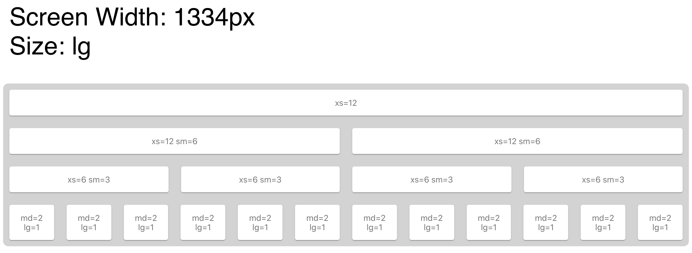

# Material UI: `<Grid>` and `<Hidden>`

A small example to show how the `xs, sm, md, lg, xl` "breakpoints" work in the `<Grid>` and `<Hidden>` component.




## Usage

```
npm install
npm start
```
